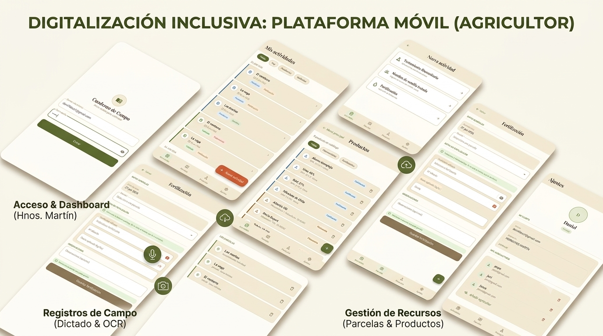
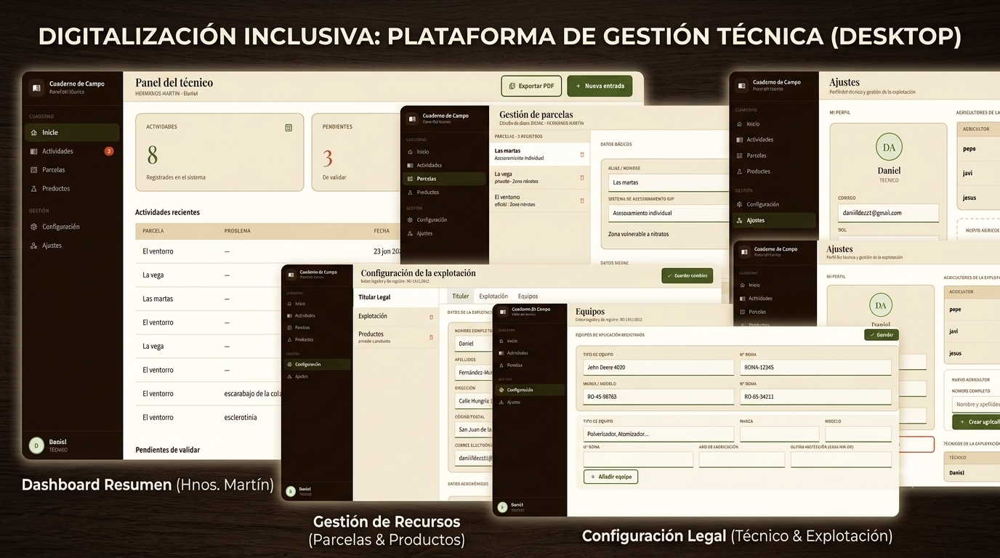

# Digitalización Inclusiva - Trabajo de Fin de Grado

Este es un proyecto **Kotlin Multiplatform (KMP)** desarrollado como Trabajo de Fin de Grado en la **Universidad de León**. La aplicación está diseñada bajo criterios de accesibilidad e inclusión digital, ofreciendo una solución multiplataforma nativa para entornos **Android (Tablet)** y **Desktop (Windows)** utilizando **Compose Multiplatform**.

---

## Vista previa de la a plicación

| Versión Android (Tablet/Dispositivo móvil) | Versión Escritorio (Windows) |
| :---: | :---: |
|  |  |

> **¿Quieres ver el funcionamiento detallado?** Puedes consultar nuestro [manual de instrucciones de la aplicación](docs/MANUAL_USUARIO.md) para ver paso a paso todas las funcionalidades de la interfaz.

---

## Descarga e instalación

No es necesario compilar el código fuente para probar la aplicación. En la sección de **Releases** de este repositorio dispones de los instaladores definitivos generados para producción:

### En la tablet o movil Android
1. Descarga el archivo ejecutable **`DigitalizacionInclusiva.apk`**.
2. Pásalo a la tablet (vía Drive, cable USB o correo) y ejecútalo.
3. *Nota:* Al ser una instalación externa a Google Play, Android te pedirá activar el permiso de **"Permitir orígenes desconocidos"**. Actívalo para completar la instalación.

### En el ordenador (Windows)
1. Descarga el instalador oficial **`DigitalizacionInclusiva-1.0.0.msi`**.
2. Haz doble clic sobre él para abrir el asistente de instalación de Windows.
3. Sigue los pasos (*Siguiente -> Instalar*) y se creará automáticamente un acceso directo en tu **Escritorio** y en el **Menú de Inicio**.

---

## Arquitectura y tecnologías utilizadas

El proyecto utiliza una arquitectura compartida donde más del 80% del código (lógica de negocio, peticiones de red y diseño de interfaces) se escribe una sola vez.

* **Lenguaje:** [Kotlin](https://kotlinlang.org/) (Multiplatform)
* **Interfaz de Usuario:** [Compose Multiplatform](https://www.jetbrains.com/lp/compose-multiplatform/)
* **Cliente HTTP & API:** [Ktor](https://ktor.io/) para la comunicación y sincronización de datos en la nube.
* **Entorno de Desarrollo:** Android Studio / IntelliJ IDEA con Gradle.

---

## Estructura del código fuente

* [`composeApp/src/commonMain`](./composeApp/src/commonMain/kotlin): Código core compartido (vistas de Compose, lógica, modelos y Ktor).
* [`composeApp/src/androidMain`](./composeApp/src/androidMain/kotlin): Configuraciones específicas y empaquetado para el target de Android.
* [`composeApp/src/jvmMain`](./composeApp/src/jvmMain/kotlin): Configuraciones específicas y empaquetado para el target de Escritorio (Windows).

---
*Desarrollado por Daniel Fernández-Muñiz Arribas - Grado en Ingeniería Informática (ULE, 2026).*
